# AgriMandi (कृषीसेतू) — Backend Schema & Database Architecture

> **Document Version:** 2.0 (Relational Architecture)  
> **Target Database Engine:** PostgreSQL 15 (Supabase Cloud) / Prisma ORM  
> **Supabase Project Reference:** `eizzzlnlcdfuylnojijn.supabase.co`  
> **Purpose:** Single source of truth for all database tables, columns, foreign keys, unique constraints, and state transition state machines.

---

## 1. Relational Entity-Relationship (ER) Diagram

```mermaid
erDiagram
    USERS ||--o| FARMER_PROFILES : "has one"
    USERS ||--o| BUYER_PROFILES : "has one"
    USERS ||--o| TRANSPORTER_PROFILES : "has one"
    USERS ||--o{ PRODUCE_LOTS : "creates (as farmer)"
    USERS ||--o{ OFFERS : "places (as buyer)"
    
    PRODUCE_LOTS ||--o{ OFFERS : "receives"
    PRODUCE_LOTS ||--o| DEALS : "locks into"
    PRODUCE_LOTS ||--o{ LOT_AGGREGATION_ITEMS : "aggregates children"
    
    OFFERS ||--o| DEALS : "accepted into"
    
    DEALS ||--|| LOGISTICS_BOOKINGS : "requires transit"
    DEALS ||--|| ESCROW_ACCOUNTS : "secured by"
    DEALS ||--o{ TRADE_REVIEWS : "evaluated by"
    
    MANDI_PRICES {
        int id PK
        string state
        string district
        string market
        string commodity
        string variety
        string grade
        string arrival_date
        numeric min_price
        numeric max_price
        numeric modal_price
        timestamp created_at
    }
```



---

## 2. Table Specifications & Column Dictionaries

### 2.1 Table: `users`
Core authentication and multi-role identity table.
```sql
CREATE TABLE public.users (
    id UUID PRIMARY KEY DEFAULT gen_random_uuid(),
    phone VARCHAR(15) UNIQUE NOT NULL,
    role VARCHAR(20) NOT NULL CHECK (role IN ('FARMER', 'BUYER', 'TRANSPORTER', 'ADMIN', 'FPO_MANAGER')),
    status VARCHAR(20) DEFAULT 'ACTIVE' CHECK (status IN ('ACTIVE', 'PENDING_VERIFICATION', 'SUSPENDED')),
    preferred_lang VARCHAR(5) DEFAULT 'mr' CHECK (preferred_lang IN ('mr', 'hi', 'en')),
    created_at TIMESTAMP WITH TIME ZONE DEFAULT timezone('utc'::text, now()) NOT NULL,
    updated_at TIMESTAMP WITH TIME ZONE DEFAULT timezone('utc'::text, now()) NOT NULL
);
CREATE INDEX idx_users_phone ON public.users(phone);
```

### 2.2 Table: `farmer_profiles`
Extended profile for agricultural producers.
```sql
CREATE TABLE public.farmer_profiles (
    id UUID PRIMARY KEY DEFAULT gen_random_uuid(),
    user_id UUID UNIQUE NOT NULL REFERENCES public.users(id) ON DELETE CASCADE,
    full_name VARCHAR(100) NOT NULL,
    state VARCHAR(50) DEFAULT 'Maharashtra',
    district VARCHAR(50) NOT NULL,
    taluka VARCHAR(50) NOT NULL,
    village VARCHAR(50) NOT NULL,
    pincode VARCHAR(10),
    primary_crops TEXT[] DEFAULT ARRAY['Soybean'],
    land_size_acres NUMERIC(6,2),
    saat_bara_number VARCHAR(50),
    bank_account_no VARCHAR(50),
    bank_ifsc VARCHAR(20),
    is_verified BOOLEAN DEFAULT FALSE,
    created_at TIMESTAMP WITH TIME ZONE DEFAULT timezone('utc'::text, now()) NOT NULL
);
CREATE INDEX idx_farmer_district ON public.farmer_profiles(district);
```

### 2.3 Table: `buyer_profiles`
Institutional agro-processors, mills, and traders.
```sql
CREATE TABLE public.buyer_profiles (
    id UUID PRIMARY KEY DEFAULT gen_random_uuid(),
    user_id UUID UNIQUE NOT NULL REFERENCES public.users(id) ON DELETE CASCADE,
    company_name VARCHAR(150) NOT NULL,
    legal_name VARCHAR(200) NOT NULL,
    gstin VARCHAR(15) UNIQUE NOT NULL,
    pan VARCHAR(10) NOT NULL,
    license_type VARCHAR(50) NOT NULL, -- e.g. 'APMC Direct Purchase', 'Oil Mill Processor'
    license_number VARCHAR(100),
    district VARCHAR(50) NOT NULL,
    city VARCHAR(100) NOT NULL,
    target_crops TEXT[] NOT NULL,
    rating NUMERIC(3,2) DEFAULT 5.00,
    reviews_count INT DEFAULT 0,
    is_verified BOOLEAN DEFAULT FALSE,
    verified_at TIMESTAMP WITH TIME ZONE,
    created_at TIMESTAMP WITH TIME ZONE DEFAULT timezone('utc'::text, now()) NOT NULL
);
CREATE INDEX idx_buyer_gstin ON public.buyer_profiles(gstin);
```

### 2.4 Table: `transporter_profiles`
Hyperlocal rural logistics partners.
```sql
CREATE TABLE public.transporter_profiles (
    id UUID PRIMARY KEY DEFAULT gen_random_uuid(),
    user_id UUID UNIQUE NOT NULL REFERENCES public.users(id) ON DELETE CASCADE,
    driver_name VARCHAR(100) NOT NULL,
    vehicle_number VARCHAR(20) UNIQUE NOT NULL,
    vehicle_type VARCHAR(50) NOT NULL, -- 'Bolero Pickup (2 MT)', 'Eicher 14ft (5 MT)', '10-Wheeler (16 MT)'
    capacity_mt NUMERIC(6,2) NOT NULL,
    base_district VARCHAR(50) NOT NULL,
    per_km_rate NUMERIC(6,2) DEFAULT 4.20,
    is_available BOOLEAN DEFAULT TRUE,
    created_at TIMESTAMP WITH TIME ZONE DEFAULT timezone('utc'::text, now()) NOT NULL
);
```

### 2.5 Table: `mandi_prices` (Live Supabase Table)
Daily market rate feed from `data.gov.in` official Agmarknet API.
```sql
CREATE TABLE public.mandi_prices (
    id SERIAL PRIMARY KEY,
    state VARCHAR(50) NOT NULL,
    district VARCHAR(50) NOT NULL,
    market VARCHAR(100) NOT NULL,
    commodity VARCHAR(50) NOT NULL,
    variety VARCHAR(50) DEFAULT 'FAQ',
    grade VARCHAR(50) DEFAULT 'Local',
    arrival_date VARCHAR(20) NOT NULL,
    min_price NUMERIC NOT NULL,
    max_price NUMERIC NOT NULL,
    modal_price NUMERIC NOT NULL,
    created_at TIMESTAMP WITH TIME ZONE DEFAULT timezone('utc'::text, now()) NOT NULL,
    CONSTRAINT unique_mandi_commodity_date UNIQUE (market, commodity, arrival_date)
);
CREATE INDEX idx_mandi_commodity ON public.mandi_prices(commodity, arrival_date);
CREATE INDEX idx_mandi_market ON public.mandi_prices(market);
```

### 2.6 Table: `produce_lots`
Farm-gate lots created by individual farmers or FPOs.
```sql
CREATE TABLE public.produce_lots (
    id UUID PRIMARY KEY DEFAULT gen_random_uuid(),
    farmer_id UUID NOT NULL REFERENCES public.users(id) ON DELETE RESTRICT,
    crop VARCHAR(50) NOT NULL,
    variety VARCHAR(50) NOT NULL,
    quantity_qtl NUMERIC(8,2) NOT NULL,
    expected_price_per_qtl NUMERIC(8,2) NOT NULL,
    moisture_percentage NUMERIC(4,2),
    foreign_matter_pct NUMERIC(4,2),
    quality_grade VARCHAR(20) DEFAULT 'FAQ',
    farm_lat NUMERIC(9,6),
    farm_lng NUMERIC(9,6),
    farm_address TEXT NOT NULL,
    district VARCHAR(50) NOT NULL,
    is_fpo_aggregated BOOLEAN DEFAULT FALSE,
    fpo_parent_id UUID,
    status VARCHAR(30) DEFAULT 'LISTED' CHECK (status IN ('DRAFT', 'LISTED', 'UNDER_BIDDING', 'DEAL_LOCKED', 'DISPATCHED', 'COMPLETED', 'CANCELLED')),
    created_at TIMESTAMP WITH TIME ZONE DEFAULT timezone('utc'::text, now()) NOT NULL
);
CREATE INDEX idx_lots_status ON public.produce_lots(status, crop);
```

### 2.7 Table: `offers`
Binding digital offers placed by buyers on produce lots.
```sql
CREATE TABLE public.offers (
    id UUID PRIMARY KEY DEFAULT gen_random_uuid(),
    lot_id UUID NOT NULL REFERENCES public.produce_lots(id) ON DELETE CASCADE,
    buyer_id UUID NOT NULL REFERENCES public.users(id) ON DELETE RESTRICT,
    offered_price_per_qtl NUMERIC(8,2) NOT NULL,
    quantity_requested_qtl NUMERIC(8,2) NOT NULL,
    delivery_destination TEXT NOT NULL,
    valid_until TIMESTAMP WITH TIME ZONE NOT NULL,
    status VARCHAR(20) DEFAULT 'PENDING' CHECK (status IN ('PENDING', 'ACCEPTED', 'REJECTED', 'EXPIRED')),
    created_at TIMESTAMP WITH TIME ZONE DEFAULT timezone('utc'::text, now()) NOT NULL
);
CREATE INDEX idx_offers_lot ON public.offers(lot_id, status);
```

### 2.8 Table: `deals`
Executed contracts after a farmer accepts an offer.
```sql
CREATE TABLE public.deals (
    id UUID PRIMARY KEY DEFAULT gen_random_uuid(),
    lot_id UUID UNIQUE NOT NULL REFERENCES public.produce_lots(id),
    offer_id UUID UNIQUE NOT NULL REFERENCES public.offers(id),
    farmer_id UUID NOT NULL REFERENCES public.users(id),
    buyer_id UUID NOT NULL REFERENCES public.users(id),
    final_price_per_qtl NUMERIC(8,2) NOT NULL,
    agreed_quantity_qtl NUMERIC(8,2) NOT NULL,
    total_deal_value NUMERIC(12,2) NOT NULL,
    gate_actual_weight_qtl NUMERIC(8,2),
    gate_moisture_pct NUMERIC(4,2),
    escrow_status VARCHAR(30) DEFAULT 'AWAITING_DEPOSIT' CHECK (escrow_status IN ('AWAITING_DEPOSIT', 'FUNDED', 'RELEASED_TO_FARMER', 'REFUNDED_BUYER', 'DISPUTED')),
    delivery_status VARCHAR(30) DEFAULT 'PENDING_DISPATCH' CHECK (delivery_status IN ('PENDING_DISPATCH', 'IN_TRANSIT', 'GATE_ARRIVED', 'QUALITY_ACCEPTED', 'REJECTED')),
    created_at TIMESTAMP WITH TIME ZONE DEFAULT timezone('utc'::text, now()) NOT NULL
);
```

### 2.9 Table: `escrow_accounts`
RBI-compliant funds tracking ledger.
```sql
CREATE TABLE public.escrow_accounts (
    id UUID PRIMARY KEY DEFAULT gen_random_uuid(),
    deal_id UUID UNIQUE NOT NULL REFERENCES public.deals(id) ON DELETE RESTRICT,
    total_deposit_amount NUMERIC(12,2) NOT NULL,
    farmer_payout_amount NUMERIC(12,2) NOT NULL,
    transporter_freight_amount NUMERIC(10,2) NOT NULL,
    platform_service_fee NUMERIC(10,2) NOT NULL,
    escrow_trustee_reference VARCHAR(100),
    disbursement_tx_id VARCHAR(100),
    disbursed_at TIMESTAMP WITH TIME ZONE,
    status VARCHAR(20) DEFAULT 'LOCKED' CHECK (status IN ('LOCKED', 'DISBURSED', 'REFUNDED', 'ON_HOLD'))
);
```

---

## 3. State Machines & Transition Rules

### 3.1 Produce Lot Lifecycle
```
[DRAFT]
   │ (Farmer clicks "Publish Lot")
   ▼
[LISTED] ◄────── (Multiple Buyers submit offers)
   │
   │ (Farmer reviews bids & clicks "Accept Offer")
   ▼
[DEAL_LOCKED] ──► Produce blocked from double-selling
   │
   │ (Transporter scans pickup QR code)
   ▼
[DISPATCHED]
   │
   │ (Gate quality weighbridge verified at buyer mill)
   ▼
[COMPLETED]
```

### 3.2 Escrow Settlement Lifecycle
```
[AWAITING_DEPOSIT]
   │ (Buyer completes RTGS / Bank Gateway Transfer)
   ▼
[FUNDED / LOCKED] ──► Safe custody in RBI Escrow Account
   │
   │ (Vehicle reaches mill gate, moisture is certified)
   ▼
[QUALITY_ACCEPTED]
   │
   │ (T+1 Automated NEFT / IMPS trigger)
   ▼
[RELEASED_TO_FARMER] (100% Net Realization credited)
```

---

## 4. Prisma Schema Blueprint (`schema.prisma`)

```prisma
datasource db {
  provider = "postgresql"
  url      = env("DATABASE_URL")
}

generator client {
  provider = "prisma-client-js"
}

enum Role {
  FARMER
  BUYER
  TRANSPORTER
  ADMIN
  FPO_MANAGER
}

enum LotStatus {
  DRAFT
  LISTED
  UNDER_BIDDING
  DEAL_LOCKED
  DISPATCHED
  COMPLETED
  CANCELLED
}

enum EscrowStatus {
  AWAITING_DEPOSIT
  FUNDED
  RELEASED_TO_FARMER
  REFUNDED_BUYER
  DISPUTED
}

model MandiPrice {
  id          Int      @id @default(autoincrement())
  state       String
  district    String
  market      String
  commodity   String
  variety     String   @default("FAQ")
  grade       String   @default("Local")
  arrivalDate String   @map("arrival_date")
  minPrice    Decimal  @map("min_price")
  maxPrice    Decimal  @map("max_price")
  modalPrice  Decimal  @map("modal_price")
  createdAt   DateTime @default(now()) @map("created_at")

  @@unique([market, commodity, arrivalDate])
  @@map("mandi_prices")
}
```
