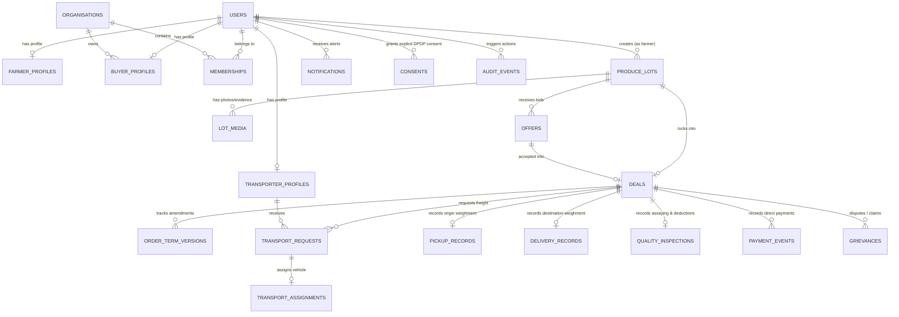

# AgriMandi (कृषीसेतू) — Backend Schema & Database Architecture

> **Document Version:** 3.0 (Canonical Schema Reconciliation — AG-004)  
> **Target Database Engine:** PostgreSQL 15 (Supabase Cloud `lqoychozoysmxibhcmuf.supabase.co`)  
> **ORM & Schema Definition:** Reconciled `prisma/schema.prisma` & `backend/supabase_schema.sql`  
> **Standard Compliance:** Canonical Implementation Instruction (22 September 2026, Section 2.3, 7, 8)  
> **Purpose:** Single source of truth for all 26 canonical database entities, status enums, foreign keys, indexes, and immutable audit logging.

---

## 1. Canonical Relational Architecture & ER Overview



---

## 2. The 26 Canonical Entities & Table Specifications

| # | Table Name | Purpose | Key Constraints & Relations |
|---|---|---|---|
| 1 | `public.users` | Core auth identity & role | `id` PK, `phone` UNIQUE, `role` CHECK, `preferred_lang` |
| 2 | `public.organisations` | Legal entities (FPOs, Mills, Traders) | `id` PK, `registration_no` UNIQUE, `gstin` UNIQUE |
| 3 | `public.memberships` | Multi-user organisation mapping | `user_id` FK -> users, `organisation_id` FK -> organisations, UNIQUE(user_id, organisation_id) |
| 4 | `public.farmer_profiles` | Agricultural producer data | `user_id` FK -> users (UNIQUE, CASCADE), `saat_bara_number`, `verification_status` |
| 5 | `public.buyer_profiles` | Agro-processors, mills, traders | `user_id` FK -> users, `organisation_id` FK, `gstin` UNIQUE, `status` CHECK |
| 6 | `public.transporter_profiles` | Logistics providers | `user_id` FK -> users, `vehicle_number` UNIQUE, `status` CHECK, `capacity_mt` |
| 7 | `public.verification_cases` | Review-based trust inspection cases | `entity_type` CHECK, `status` CHECK, `reviewed_by`, `decision_notes` |
| 8 | `public.verification_documents` | Verification proof files metadata | `case_id` FK -> verification_cases, `uploaded_by` FK, `bucket_name`, `visibility` |
| 9 | `public.consents` | DPDP explicit user data consents | `user_id` FK -> users, `consent_type`, `is_granted`, `ip_address`, `granted_at` |
| 10 | `public.markets` | APMC mandis registry | `name`, `district`, `state`, `latitude`, `longitude`, UNIQUE(name, district, state) |
| 11 | `public.commodities` | Standard crop catalog | `name` UNIQUE, `local_name`, `category`, `standard_unit` |
| 12 | `public.mandi_prices` / `market_prices` | Agmarknet live price feed | `market`, `commodity`, `arrival_date`, `modal_price`, UNIQUE(market, commodity, arrival_date) |
| 13 | `public.produce_lots` / `lots` | Farm-gate harvest listings | `farmer_id` FK -> users, `crop`, `quantity_qtl`, `expected_price_per_qtl`, `status` |
| 14 | `public.lot_media` | Compressed crop photos (WebP, <5MB) | `lot_id` FK -> produce_lots, `bucket_name`, `object_path`, `is_primary` |
| 15 | `public.buyer_demand_posts` | Buyer procurement requirements | `buyer_id` FK -> users, `commodity`, `required_quantity_qtl`, `status` |
| 16 | `public.offers` | Structured buyer bids | `lot_id` FK -> produce_lots, `buyer_id` FK, `offered_price_per_qtl`, `status` |
| 17 | `public.deals` / `orders` | Commercial trade contracts | `lot_id` FK, `offer_id` FK, `buyer_id` FK, `farmer_id` FK, `order_status` CHECK |
| 18 | `public.order_term_versions` | Versioned immutable trade terms | `order_id` FK -> deals, `version_number`, UNIQUE(order_id, version_number) |
| 19 | `public.transport_requests` | Freight booking dispatch | `order_id` FK -> deals, `transporter_id` FK, `freight_amount`, `status` |
| 20 | `public.transport_assignments` | Confirmed vehicle & driver assignment | `request_id` FK -> transport_requests, `transporter_id` FK, `vehicle_number` |
| 21 | `public.pickup_records` | Origin farm-gate weighment evidence | `order_id` FK -> deals, `gross_weight`, `tare_weight`, `net_weight`, `slip_path` |
| 22 | `public.delivery_records` | Destination buyer weighment evidence | `order_id` FK -> deals, `gross_received_weight`, `tare_weight`, `net_received_weight` |
| 23 | `public.quality_inspections` | Mill assaying & quality deductions | `order_id` FK -> deals, `moisture_percentage`, `accepted_quantity_qtl`, `deduction_inr` |
| 24 | `public.payment_events` | Direct bank transfer & settlement proof | `order_id` FK -> deals, `event_type` CHECK, `amount`, `payment_reference`, `proof_path` |
| 25 | `public.grievances` | Commercial dispute resolution cases | `order_id` FK -> deals, `raised_by_user_id` FK, `grievance_type`, `status` |
| 26 | `public.notifications` | User alerts & system events | `user_id` FK -> users, `notification_type` CHECK, `is_read` |
| 27 | `public.audit_events` | Immutable security audit ledger | `id` PK, `actor_id`, `action`, `entity`, `entity_id`, `previous_state`, `new_state` |

---

## 3. Order State Machine (Section 8 Standard)

```
DRAFT 
  ➔ PUBLISHED 
  ➔ OFFER_RECEIVED 
  ➔ OFFER_ACCEPTED 
  ➔ ORDER_CONFIRMED 
  ➔ TRANSPORT_PENDING 
  ➔ TRANSPORT_REQUESTED 
  ➔ TRANSPORT_ACCEPTED (or TRANSPORT_DECLINED) 
  ➔ TRANSPORT_ASSIGNED 
  ➔ READY_FOR_PICKUP 
  ➔ PICKED_UP 
  ➔ IN_TRANSIT 
  ➔ DELIVERED 
  ➔ RECEIVED_PENDING_INSPECTION 
  ➔ ACCEPTED (or PARTIALLY_ACCEPTED / REJECTED) 
  ➔ PAYMENT_PENDING 
  ➔ PAYMENT_SUBMITTED 
  ➔ PAYMENT_CONFIRMED 
  ➔ COMPLETED
  (Any stage can transition to DISPUTED or CANCELLED with audit reason)
```

---

## 4. Performance Indexes

High-speed B-Tree indexes configured for instant (<10ms) lookups under concurrent pilot loads:
- `idx_users_phone`, `idx_users_role`
- `idx_farmer_user_id`, `idx_farmer_district`
- `idx_buyer_user_id`, `idx_buyer_gstin`, `idx_buyer_district`
- `idx_transporter_user_id`, `idx_transporter_district`
- `idx_lots_farmer_id`, `idx_lots_crop_district`, `idx_lots_status`
- `idx_offers_lot_id`, `idx_offers_buyer_id`, `idx_offers_status`
- `idx_deals_lot_id`, `idx_deals_buyer_id`, `idx_deals_farmer_id`, `idx_deals_order_status`
- `idx_order_terms_order_id`, `idx_transport_requests_order_id`
- `idx_pickup_order_id`, `idx_delivery_order_id`, `idx_inspection_order_id`, `idx_payment_order_id`
- `idx_notifications_user_unread`, `idx_audit_entity`
