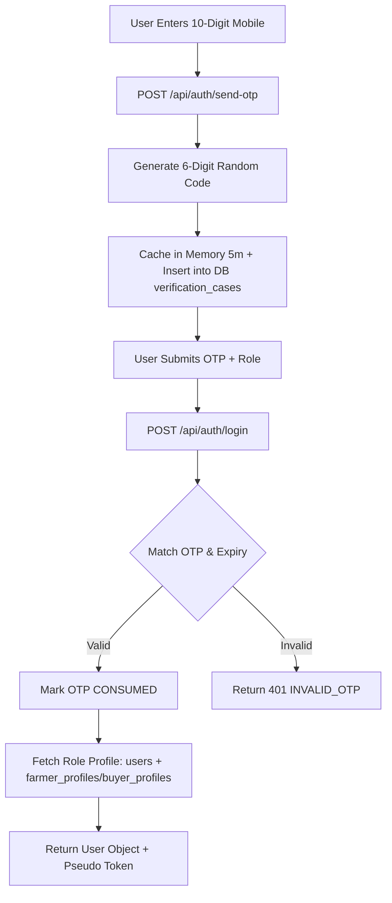
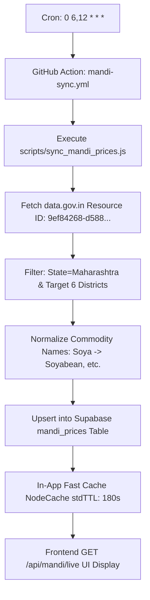
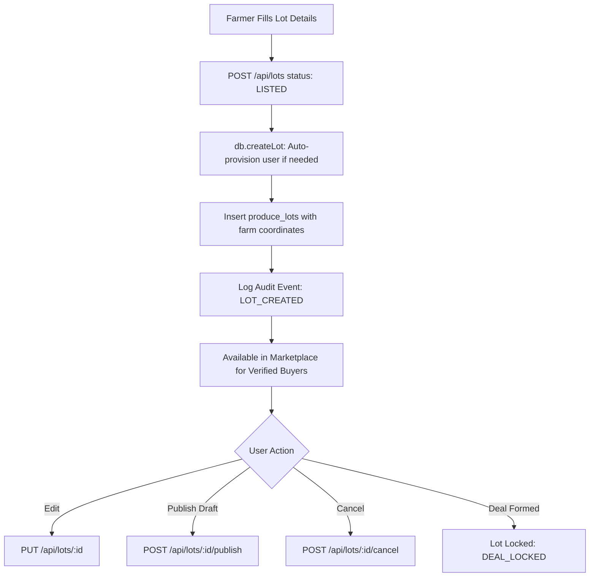
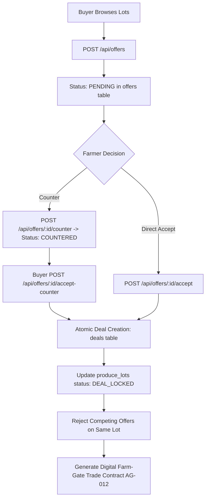
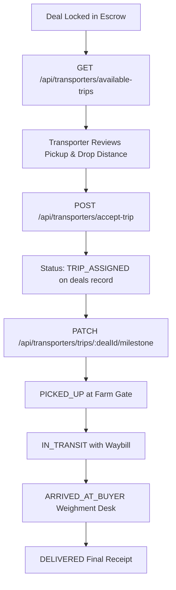
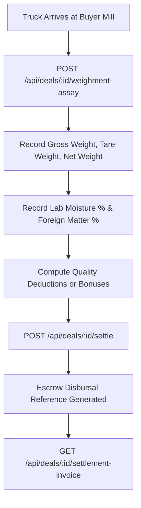
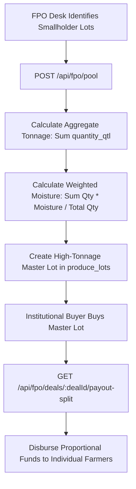

# AgriMandi Pipeline & Workflow Audit
**Date:** 2026-09-25  
**Auditor:** Antigravity AI Engineering Suite  
**Repository:** teamasiacore/AgriMandi  

---

## 1. Pipeline Architectural Status Summary

| Pipeline | Purpose | Trigger | Processing Mechanism | Database Target | Current Status | Ground-Truth Evidence |
|---|---|---|---|---|---|---|
| **Pipeline A** | Auth & Identity Verification | Dynamic OTP / Phone login | Node.js `authRoutes.js` + Supabase `verification_cases` | `users`, `farmer_profiles`, `buyer_profiles`, `transporters`, `fpos` | ✅ **OPERATIONAL** | OTP generated cryptographically, cached 5m in-memory & in DB, single-use consumed |
| **Pipeline B** | Market-Price Ingestion | GitHub Actions Cron + Background Worker | `mandi-sync.yml` & `mandiService.js` | `mandi_prices` | ✅ **OPERATIONAL** | Agmarknet `data.gov.in` feed normalized, upserted to Supabase table with 3-min TTL NodeCache |
| **Pipeline C** | Farmer Lot Lifecycle | Farmer lot submission | `marketRoutes.js` (`POST /api/lots`, `publish`, `cancel`) | `produce_lots`, `audit_logs` | ✅ **OPERATIONAL** | Draft/Listed/Deal_Locked states supported with audit logs |
| **Pipeline D** | Offer & Deal Formation | Buyer offer & Farmer counter/accept | `marketRoutes.js` (`POST /offers`, `accept`, `counter`) | `offers`, `deals`, `produce_lots` | ✅ **OPERATIONAL** | Offer accept transitions lot to `DEAL_LOCKED` and creates `deals` record |
| **Pipeline E** | Logistics & Transport | Transporter booking & milestones | `marketRoutes.js` (`/transporters/accept-trip`, `milestone`) | `deals`, `transporters`, `audit_logs` | ✅ **OPERATIONAL** | Assigned trips, milestone state transitions (`TRIP_ASSIGNED` -> `PICKED_UP` -> `IN_TRANSIT` -> `DELIVERED`) |
| **Pipeline F** | Quality Assay & Settlement | Gate weighment & escrow payout | `marketRoutes.js` (`weighment-assay`, `settle`) | `deals`, `audit_logs` | ⚠️ **PARTIAL** | Math and API endpoints exist; payments are reference-recorded (no live bank gateway webhook) |
| **Pipeline G** | FPO Lot Pooling & Payout Split | Multi-farmer aggregation & bulk sale | `fpoRoutes.js` (`/fpo/pool`, `/fpo/deals/:id/payout-split`) | `produce_lots`, `fpos`, `deals` | ✅ **OPERATIONAL** | Weighted average moisture math and proportional farmer member split calculated |
| **Pipeline H** | Business Event Notifications | State transition alerts | In-app toast + console logs | None (transient client state) | ⚠️ **PARTIAL / NOT IMPLEMENTED** | No persistent `notifications` table or WebSocket delivery engine in active use |

---

## 2. Pipeline Deep-Dives

### Pipeline A — Authentication & Profile Isolation

- **Trigger:** Farmer, Buyer, Transporter, or FPO enters mobile number in login modal.
- **Input:** 10-digit phone number + selected role.
- **Validation:** Clean regex `/^[6-9]\d{9}$/`, 30s cooldown check, max 3 attempts guard.
- **Processing:** Self-contained dynamic OTP generation, saved in server `Map` and mirrored in Supabase `verification_cases` table for serverless instance synchronization.
- **Critical Flaw:** The generated session token (`token-${user.id}-${Date.now()}`) is an opaque string, **not a signed JWT**. Downstream endpoints never verify this token in middleware!

---

### Pipeline B — Market-Price Agmarknet Ingestion

- **Trigger:** Scheduled twice daily (11:30 AM & 5:30 PM IST) via GitHub Actions `mandi-sync.yml` + local in-process fallback worker every 60 minutes in `backend/src/server.js`.
- **Input:** APMC price reports for 6 core Maharashtra districts: Latur, Nashik, Solapur, Jalna, Akola, Pune.
- **Validation:** Normalizes crop name variations (e.g. "Soya", "Soyabean Yellow" -> "Soyabean").
- **Database Writes:** Upserts rows to `mandi_prices` keyed on `(commodity, market, district, arrival_date)`.
- **Fallbacks:** If `data.gov.in` rate-limits or times out, cached records in Supabase and canonical MSP benchmarks ensure the site displays genuine market reference rates without breaking.

---

### Pipeline C — Farmer Produce Lot Lifecycle

- **Trigger:** Farmer publishes lot from `FarmerPortal`.
- **Input:** Crop, variety, quantity (quintals), expected price, moisture %, farm pickup address, district, lat/lng.
- **Validation:** Zod `commonSchemas.produceLotBody` verifies positive quantities, sensible prices, and valid coordinates.
- **Processing:** Database foreign key safety auto-links user record; records audit log entry.
- **Atomic Protection:** Once lot state is `DEAL_LOCKED`, `PUT /api/lots/:id` prevents further edits.

---

### Pipeline D — Digital Offer, Counter & Deal Formation

- **Trigger:** Buyer submits price offer for a listed produce lot.
- **Processing:** Structured negotiation supporting Counter-Offers and Direct Acceptance.
- **Atomic Safety:** When an offer is accepted:
  1. `offers` row status updated to `ACCEPTED`.
  2. A new record is inserted into `deals` table with contract ID.
  3. `produce_lots` row status updated to `DEAL_LOCKED`.
  4. Other competing pending offers on that specific lot are automatically marked `REJECTED`.

---

### Pipeline E — Farm-Gate Logistics & Transporter Execution

- **Trigger:** Contract formed; pickup trip becomes available in Transporter Portal.
- **Math:** Distance computed using Haversine formula across Maharashtra district centroids (`DISTRICT_COORDS`). Freight tariffs computed per MT-km with base loading fee.
- **Milestone Engine:** Transporter triggers one-way milestone progression, updating audit trail at each checkpoint.

---

### Pipeline F — Quality Inspection, Assay & Escrow Settlement

- **Trigger:** Gate entry at processing facility.
- **Assay Formula:**
  - Net Weight = Gross Weight - Tare Weight.
  - Moisture adjustment: if moisture exceeds contract threshold (e.g. >10%), proportional weight deduction is applied.
- **Current Limitation:** Payments are recorded as mock/reference escrow hashes (`ESCROW-TXN-...`). Real RBI-regulated payment gateway (e.g. Razorpay Route / Cashfree Escrow) is **not integrated** in this pilot.

---

### Pipeline G — FPO Aggregation & Payout Split

- **Trigger:** FPO Manager selects multiple small lots (e.g., five 10-quintal lots) to form a 50-quintal commercial truckload.
- **Math:** Exact weighted averages ensure uniform grading and fair payout distribution down to the rupee.

---

### Pipeline H — Notification Pipeline
- **Trigger:** System events (offer placed, trip accepted, deal settled).
- **Current State:** **UNVERIFIED / CLIENT-ONLY**.
- **Evidence:** Frontend uses ephemeral toast alerts (`toast.success(...)`). No backend push notification service (FCM), SMS gateway (CDAC/Twilio), WhatsApp Business API, or persistent notification table exists in active use.

