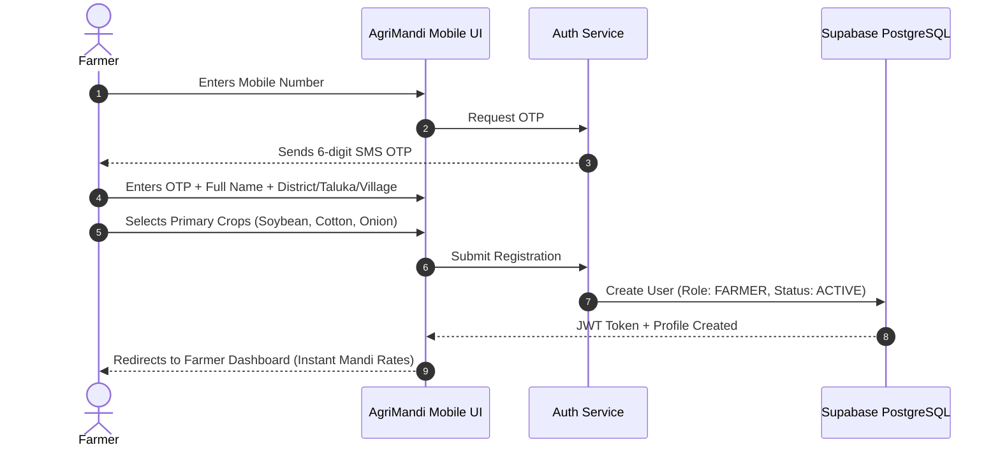
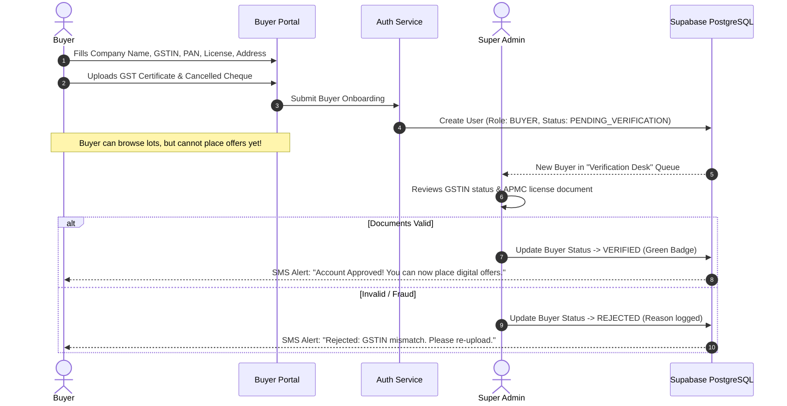
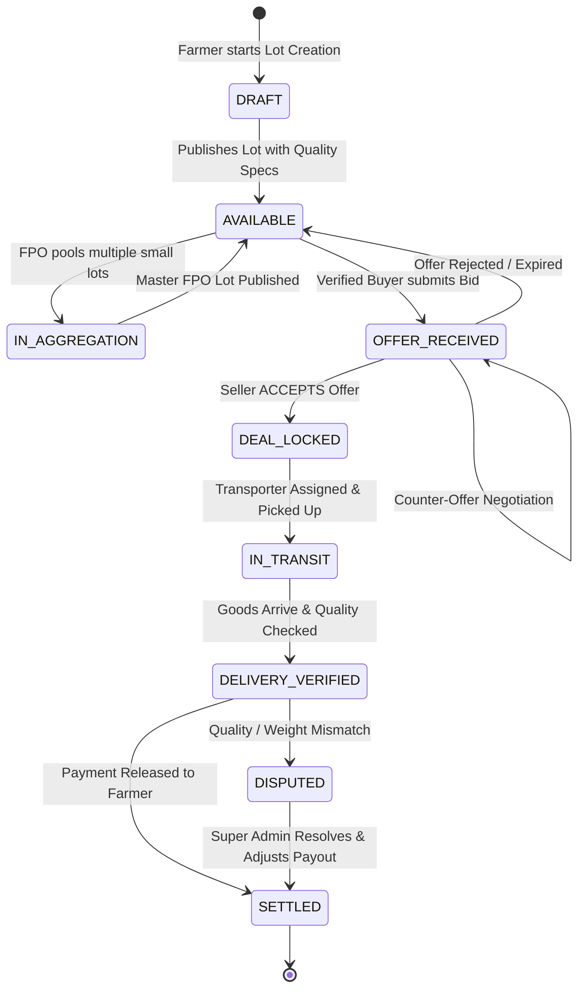

# AgriMandi (कृषीसेतू) — Complete End-to-End User Flow & 1st Trade Manual

> **SIH 2026 Problem Statement ID:** 26132  
> **Theme:** Agriculture, FoodTech & Rural Development  
> **Document Purpose:** Complete operational flow, registration blueprints, buyer categorization, lot creation, and full trade lifecycle from farm gate to final payment settlement.

---

## 1. The 4 Stakeholders (Who are they?)

```
┌────────────────────────────────────────────────────────────────────────┐
│                        AGRIMANDI USER ECOSYSTEM                        │
├───────────────────┬───────────────────┬──────────────────┬─────────────┤
│ 1. FARMER         │ 2. BUYER          │ 3. SERVICE       │ 4. SUPER    │
│    (SELLER)       │    (PURCHASER)    │    PROVIDER      │    ADMIN    │
├───────────────────┼───────────────────┼──────────────────┼─────────────┤
│ • Smallholders    │ • Oil Millers     │ • Local Goods    │ • Govt /    │
│ • Commercial      │ • Dal Millers     │   Transporters   │   MSAMB /   │
│   Farmers         │ • Wholesalers     │ • Warehouses     │   Platform  │
│ • FPO Leaders     │ • Food Retailers  │   (WDRA/Private) │   Desk      │
│   (Aggregators)   │ • Exporters       │ • Assayers       │             │
└───────────────────┴───────────────────┴──────────────────┴─────────────┘
```

### Who are the Buyers?
1. **Agro-Processors & Millers:** Soybean oil extraction mills (e.g., Latur/Solapur), Dal mills (Akola), Cotton ginning and pressing units (Jalgaon). They need large, consistent volumes with specific moisture standards.
2. **Institutional & Retail Chains:** Corporate buyers (ITC, BigBasket, Reliance Fresh, Sahyadri Farms FPC) looking for pre-graded quality produce directly from farm clusters.
3. **APMC Licensed Wholesalers & Commission Agents:** Traditional traders looking to expand procurement outside congested mandi physical yards.
4. **Bulk Exporters:** Traders exporting non-GMO soybean meal, onion, or raw cotton abroad.

---

## 2. Registration & Login Flow (What details are asked?)

### A. Farmer Registration Flow
Farmers need a **frictionless, 60-second onboarding** (no complex paperwork initially).



#### Fields Asked from Farmer:
| Field Name | Type | Mandatory? | Why is it needed? |
| :--- | :--- | :---: | :--- |
| **Full Name** | Text | ✅ Yes | Profile & invoice generation |
| **Mobile Number** | Number (10 digits) | ✅ Yes | Primary ID & OTP Login |
| **State & District** | Dropdown | ✅ Yes | Auto-load nearby mandis |
| **Taluka & Village** | Dropdown/Text | ✅ Yes | Farm-gate transport calculation |
| **Primary Crops** | Multi-select Tags | ✅ Yes | Customizes price alert feed |
| **Land Size (Acres)** | Number | ❌ Optional | Used for production estimation |
| **7/12 (Saat-Bara) No.**| Text | ❌ Optional | Awards `Verified Farmer` badge |
| **Bank / UPI Details**| Text / IFSC | ❌ Optional | Needed only during payment release |

---

### B. Buyer Registration & Super Admin Verification Flow
Buyers handle high-value transactions. To prevent fraud, **they cannot submit offers until Super Admin verifies their legal credentials**.



#### Fields Asked from Buyer:
| Field Name | Type | Mandatory? | Verification Method |
| :--- | :--- | :---: | :--- |
| **Company / Firm Name** | Text | ✅ Yes | Cross-referenced with GSTIN |
| **Buyer Category** | Dropdown (Processor/Wholesaler/Exporter/Retailer) | ✅ Yes | Filters matching algorithms |
| **Contact Person & Mobile**| Text + OTP | ✅ Yes | Phone OTP validation |
| **Business Address & District**| Text | ✅ Yes | Distance calculation for freight |
| **GSTIN Number** | 15-char AlphaNumeric | ✅ Yes | Super Admin GST portal check |
| **PAN Number** | 10-char AlphaNumeric | ✅ Yes | PAN-Aadhaar linkage check |
| **APMC Trader License No.**| Text | ❌ If Mandi Trader | District APMC directory match |
| **FSSAI License No.** | Text | ❌ If Food Processor | FSSAI registry check |
| **Bank Account + IFSC** | Numbers + Document | ✅ Yes | Cancelled cheque document preview |

---

### C. Service Provider (Transporters & Godowns) Flow
* **Transporter Fields:** Owner Name, Phone, Vehicle Number (e.g., `MH-24-AB-1234`), Vehicle Type (Pickup 1.5T, Eicher 4T, 10-Wheeler 16T), Freight Tariff (₹/km or ₹/qtl-km base), Driving License upload.
* **Warehouse / Storage Fields:** Facility Name, District/Taluka, Capacity (Quintals), Available Space, Cold Storage or Dry Godown, Monthly Rent per Quintal (e.g., ₹15/qtl/month), WDRA Registration Certificate.

---

## 3. The 1st Complete Trade Lifecycle (Step-by-Step Story)

To make this crystal clear for judges, we follow **Farmer Ramesh Patil** from **Latur, Maharashtra**, who has **50 Quintals of Soybean**.

---

### STEP 1: Market Intelligence & Net Realization Comparison
Ramesh opens AgriMandi on his phone. He selects **"Soybean"**.

```
┌────────────────────────────────────────────────────────────────────────┐
│                     MULTI-MARKET NET REALIZATION                       │
│ Produce: 50 Quintals Soybean | Farm Location: Babhalgaon, Latur       │
├────────────────┬──────────┬───────────┬──────────┬─────────────────────┤
│ Market / Buyer │ Headline │ Transport │ Loading  │ NET IN-HAND EARNING │
│                │ Price    │ (Freight) │ & Cess   │ (Realized ₹/qtl)    │
├────────────────┬──────────┬──────────────────────┬──────────┬─────────────────────────────────┤
│ Market / Buyer │ Headline │ Estimated Transport  │ Loading  │ NET IN-HAND EARNING             │
│                │ Price    │ Range [Min – Max]    │ & Cess   │ (Realized Range & Avg ₹/qtl)    │
├────────────────┼──────────┼──────────────────────┼──────────┼─────────────────────────────────┤
│ 1. Latur APMC  │ ₹4,950   │ ₹150 – ₹210 / qtl    │ -₹45/qtl │ = ₹4,695 – ₹4,755 / qtl         │
│    (38 km)     │          │ (Avg: -₹180/qtl)     │ (Mandi)  │ (Expected Avg: ₹4,725 / qtl)    │
├────────────────┼──────────┼──────────────────────┼──────────┼─────────────────────────────────┤
│ 2. Barshi APMC │ ₹5,050   │ ₹290 – ₹390 / qtl    │ -₹45/qtl │ = ₹4,615 – ₹4,715 / qtl         │
│    (82 km)     │ (Higher!)│ (Avg: -₹340/qtl)     │ (Mandi)  │ (Expected Avg: ₹4,665 / qtl)    │
├────────────────┼──────────┼──────────────────────┼──────────┼─────────────────────────────────┤
│ 3. Om Agro Mill│ ₹4,880   │ ₹0 (Farm-Gate Pickup │ ₹0       │ = ₹4,880 / qtl 🏆               │
│    (Direct)    │ (Lower!) │  Buyer arranges veh.)│ (Direct) │ (HIGHEST & GUARANTEED PROFIT)   │
└────────────────┴──────────┴──────────────────────┴──────────┴─────────────────────────────────┘
```

> ⚠️ **Dynamic Transport Disclaimer (UI Badge):**  
> *"वाहतूक खर्च हा अंदाजित (Estimated Range) आहे. प्रत्यक्ष खर्च वाहनाचा प्रकार (पिकअप/आयशर/ट्रॅक्टर), रस्त्याची स्थिती (डांबरी/कच्चा रस्ता), आणि लोड (पूर्ण गाडी/शेअरिंग) यावर बदलू शकतो."*  
> *(Freight is shown as an estimated Range & Average. Real cost varies dynamically based on: 1. Vehicle Type, 2. Road Condition, 3. Load Utilization, and 4. Fuel/Tariff rates).*

> **The Awakening:** Even though Barshi APMC shows a higher sticker price (₹5,050 vs ₹4,880), the Net Realization Engine proves that after subtracting even the minimum transport cost (₹290) and cess, the direct processor gives **₹165 to ₹265 per quintal MORE cash in hand** with zero transit risk!

---

### STEP 2: AI Sell / Hold / Monitor Advisor Consultation
Ramesh taps **"AI Advisor"** to check if he should sell today or wait.

* **Under the Hood (XGBoost + Rule Engine):**
  * Current Soybean Modal Price in Latur: ₹4,880
  * 30-Day Moving Average: ₹4,750 (+2.7% upward momentum)
  * Mandi Arrivals: 4,200 bags (Declining by 14% this week $\rightarrow$ Low supply pressure)
  * Local Storage Cost: ₹12/quintal/month
  * 7-Day Expected Price Forecast: **₹4,980 – ₹5,050** (Confidence: 89%)
* **Screen Display for Ramesh:**
  ```
  🟡 RECOMMENDATION: HOLD (for 5 to 7 days)
  
  Why?
  • Price Momentum: Soybean prices have risen +2.7% over the last 7 days.
  • Supply Trend: Mandi arrivals dropped 14% this week, indicating tightening supply.
  • Storage Economics: Holding 50 quintals for 7 days costs only ₹140 total, 
    while expected price appreciation is ~₹5,000 to ₹8,000.
  ```

---

### STEP 3: Produce Lot Creation
Ramesh decides to list his produce for sale on his target date.


* **Lot Status:** `AVAILABLE` (Visible to matched verified buyers).

---

### STEP 4 (Alternative): FPO Bulk Aggregation Flow
*What if Ramesh only had 8 Quintals?*
* A large oil mill will not send a 10-ton truck for 8 quintals.
* **FPO Manager Action:** Local FPO (e.g., Latur Kisan FPC) selects 5 small farmer lots in Babhalgaon:
  * Ramesh: 8 qtl
  * Tukaram: 12 qtl
  * Shivaji: 15 qtl
  * Balaji: 10 qtl
  * Anand: 15 qtl
  * **Total:** **60 Quintals Master Lot**
* The Master Lot is listed on AgriMandi. Corporate buyers bid on the 60-quintal lot. Payouts are automatically split proportionally to each farmer's bank account when the deal settles!

---

### STEP 5: Buyer Requirement & Smart Matchmaking
**Buyer:** Shrinath Agro Oil Mill (Latur) has an active requirement:
* *Wanted: 50–200 Quintals Soybean, Moisture < 11%, District: Latur/Osmanabad, Budget: Up to ₹4,950/qtl.*

**AgriMandi Cosine Match Engine runs:**
* Commodity: 100% Match
* Location Proximity: 94% (Within 25 km)
* Quality Tolerance: 96% (10% moisture is well below 11% max)
* Quantity Compatibility: 95% (50 qtl fits the 50–200 qtl bucket)
* **Overall Match Score:** **96% (Top Match 🟢)**

---

### STEP 6: Digital Offer & Negotiation
1. Shrinath Agro Mill opens the lot and submits a **Digital Offer**:
   * Offered Price: **₹4,920 / quintal**
   * Total Value: **₹2,46,000**
   * Terms: **Farm-gate pickup** (Freight covered by Buyer, coordinated via AgriMandi's local transporter network).
2. Ramesh receives an SMS alert & app notification:
   > *"New Offer received from Shrinath Agro Oil Mill (Verified ✅): ₹4,920/qtl for your 50 qtl Soybean. (Buyer covers transport via local pickup)."*
3. Ramesh has 3 choices:
   * **[Accept]**
   * **[Counter-Offer]** (e.g., asks for ₹4,940)
   * **[Reject]**
4. Ramesh taps **[Accept Offer]**.

---

### STEP 7: Deal Lock & Double-Selling Prevention
* The moment Ramesh clicks **Accept**:
  * PostgreSQL updates `Lot.status = DEAL_LOCKED`.
  * Other buyers can no longer bid on this lot.
  * A formal **Deal Contract #DEAL-9941** is generated in the system.

---

### STEP 8: Logistics Discovery & Booking (The Local Vehicle Problem Solved!)
> 💡 **The Problem:** The buyer is 40 km away in the city and has no idea which driver or vehicle is free in Ramesh's village (Babhalgaon).  
> 🚀 **AgriMandi's Solution:** The platform uses the Farmer's Taluka/GPS to automatically discover registered local goods transporters within a 15–20 km radius.

* **Screen Shown to Both Farmer & Buyer:**  
  *Both parties see a live list of "Available Vehicles Near Farm Gate":*

  | Transporter / Driver | Vehicle Type | Capacity | Distance from Farm | Estimated Rate | Action |
  | :--- | :--- | :--- | :--- | :--- | :--- |
  | **Mauli Goods (Dnyaneshwar M.)** | Eicher 14-Ft (`MH-24-V-8812`) | 5 Ton (50 qtl) | 6 km (Babhalgaon) | ₹170 – ₹190 / qtl | ⭐ Recommended |
  | **Kisan Transport (Suresh P.)** | Bolero Maxi (`MH-24-AB-4410`) | 1.5 Ton (15 qtl) | 3 km (Local Village) | ₹210 / qtl | (Small Load) |
  | **Tractor Trolley (Balaji K.)** | Swaraj Tractor (`MH-24-TR-0911`)| 4 Ton (40 qtl) | 2 km (Neighboring Wasti)| ₹140 / qtl | (Short Haul) |

* **Seller (Farmer) Selection:**  
  * Since Ramesh is physically in the village and knows the road, **Ramesh selects Mauli Goods Transport** (Eicher 14-Ft, perfect for 50 quintals).
  * System sends an instant Booking Notification to Driver Dnyaneshwar:  
    > *"🔔 New Pickup Alert: 50 qtl Soybean from Babhalgaon (Ramesh Patil) to Shrinath Agro Mill, Latur. Agreed Freight: ₹9,000. Tap to Accept."*
  * Driver accepts $\rightarrow$ Live vehicle tracking and pickup OTP generated.
* Deal Status moves to: `GOODS_IN_TRANSIT`.

---

### STEP 9: Delivery & Quality Verification (Gate Inspection)
1. Vehicle arrives at Shrinath Agro Mill.
2. The mill assayer draws samples and inserts a digital moisture meter.
3. Test Result: **Moisture 9.8%, Foreign Matter 1.2%** (Meets declared Grade A standard).
4. Mill Manager clicks **"Confirm Quality & Delivery Received"** on his AgriMandi app.
5. System state moves to: `DELIVERY_VERIFIED`.

---

### STEP 10: Payment Milestone Settlement
1. Buyer had already deposited commitment funds into the platform transaction ledger (`ESCROW_LOCKED`).
2. Upon delivery verification, the system triggers the settlement release:
   * ₹2,46,000 transferred to Ramesh Patil's bank account via direct IMPS/NEFT reference.
3. Ramesh receives confirmation on his phone:
   > *"₹2,46,000 credited to Bank of Maharashtra A/C ending 4412. Deal #DEAL-9941 Closed."*
4. Status moves to: `COMPLETED`.

---

### STEP 11: Two-Way Feedback & Reputation Rating (The Trust Builder! ⭐)
*After deal completion, an interactive rating modal pops up on both apps:*

```
┌────────────────────────────────────────────────────────────────────────┐
│                   TWO-WAY VERIFIED TRADE REVIEW                        │
├──────────────────────────────────┬─────────────────────────────────────┤
│ 👨‍🌾 FARMER RATES BUYER           │ 🏭 BUYER RATES FARMER               │
├──────────────────────────────────┼─────────────────────────────────────┤
│ • Rating: ⭐⭐⭐⭐⭐ (5.0 / 5)    │ • Rating: ⭐⭐⭐⭐⭐ (5.0 / 5)     │
│ • Quick Tags Selected:           │ • Quick Tags Selected:              │
│   [Fast Settlement] [Fair Weight]│   [Accurate Moisture] [Clean Bags]  │
│ • Ramesh's Feedback:             │ • Shrinath Mill's Feedback:         │
│   "Shrinath Mill ne gate par     │   "Ramesh Patil's lot was exactly as│
│   ekdam fair weight kiya aur     │   described. Moisture was under 10%.│
│   paisa 15 minute me bhej diya.  │   Honest farmer, highly recommended │
│   Khup changla vyavahar!"        │   for future bulk contracts."       │
└──────────────────────────────────┴─────────────────────────────────────┘
```

* **How this builds long-term value:**
  1. **Only Real Deals Can Rate:** Zero fake reviews. You can only rate if you completed a verified trade `#DEAL-XXXX`.
  2. **Profile Trust Badge:**
     - Farmer Profile: `⭐ 4.9 (14 Deals) - Verified Quality Producer`
     - Buyer Profile: `⭐ 4.8 (38 Deals) - 100% On-Time Payer`
  3. **Algorithm Boost:** Farmers and Buyers with $\ge 4.5$ star rating get a **+5% Matchmaking Score Boost** and rank at the top of buyer demand feeds.
  4. **Fraud Auto-Flag:** If a buyer's rating drops below $3.0$ with tags like `[Payment Delayed]` or `[Unjust Deduction]`, their account is automatically locked for Super Admin audit!

---

### STEP 12: Grievance Redressal (If any dispute occurs)
* *What if the buyer claimed the moisture was 14% and cut ₹10,000 unjustly?*
  * Ramesh clicks **"Raise Grievance"**.
  * Attaches photo of the weighbridge slip and farm-gate moisture report.
  * Ticket #DISP-102 goes straight to the **Super Admin (District Marketing Officer)** dashboard.
  * Super Admin freezes the disputed deduction amount until both parties submit verified assayer slips.

---

## 4. End-to-End System State Machine Flowchart



---

## 5. Judge Demo Cheat-Sheet (How to pitch this in 5 minutes)

When judges ask you to demonstrate the flow during your presentation, use this **3-minute live script**:

1. **Minute 1 (The Problem & Discovery):**  
   *"Judges, meet Ramesh from Latur. e-NAM told him Latur APMC was ₹4,950. But AgriMandi's Net Realization Engine showed him that after ₹180 transport and ₹45 cess, his actual in-hand money is only ₹4,725. Meanwhile, a local oil mill offers ₹4,880 with farm-gate pickup. That is ₹155/qtl pure extra profit."*
2. **Minute 2 (The AI Intelligence):**  
   *"Before selling, Ramesh consults our XGBoost AI Advisor. The model analyzes 30-day price momentum and falling mandi arrivals to say: 'HOLD for 5 days — prices are likely to rise by ₹100/qtl, and storage will only cost ₹14/qtl'."*
3. **Minute 3 (The Safe Transaction):**  
   *"Ramesh creates Lot #0892. A GST-verified buyer matches with 96% similarity and makes an offer. Ramesh accepts, the lot locks to prevent double-selling, goods are picked up by a verified transporter, quality is confirmed at the gate, and ₹2,46,000 settlement is logged. Zero middlemen, zero hidden deductions."*
