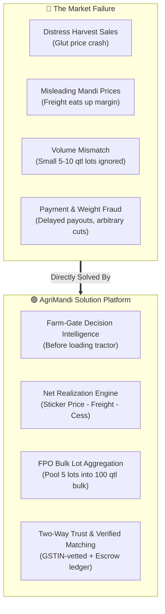
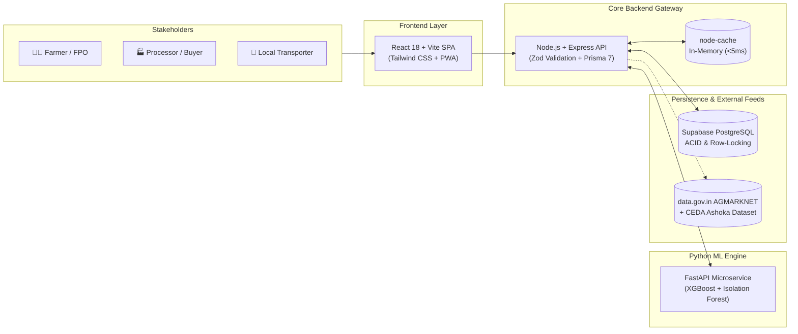
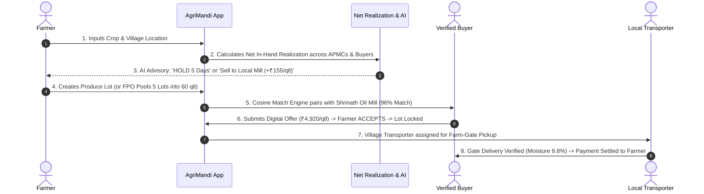

# AgriMandi (कृषीसेतू) — SIH 2026 Idea Round Visual Presentation

> **SIH 2026 Problem Statement ID:** 26132  
> **Organization:** Government of Maharashtra (Dept of Skills, Employment & Innovation)  
> **Theme:** Agriculture, FoodTech & Rural Development  
> **Visual HTML Slides Deck:** [SIH_PPT_VISUAL_SLIDES.html](file:///d:/AgriMandi/docs/SIH_PPT_VISUAL_SLIDES.html) *(Double-click to open in Chrome/Edge!)*

---

## Slide 2: Idea Title & Proposed Solution



### 4 Key Differentiators & Innovation Pillars:
1. **Net Realization Engine:** Ranks markets by actual pocket earnings after deducting dynamic freight range ($₹150 - ₹210/\text{qtl}$) and mandi cess.
2. **Explainable AI Advisor:** XGBoost 30-day price momentum and arrival shock index gives explainable `SELL NOW`, `HOLD`, or `MONITOR` calls with reasons.
3. **Hyperlocal Logistics Matcher:** Village-level discovery of registered pickup tempos, Eichers, and tractors near the farm gate.
4. **Two-Way Verified Trade Ratings:** Post-settlement reviews (`⭐ 4.9 Verified Producer` / `⭐ 4.8 Reliable Payer`) preventing fraud.

---

## Slide 2B: Competitive Benchmarking (Master Comparison Table)

| Feature / Market Capability | Traditional APMC | Govt e-NAM | Generic Price Apps | 🏆 AgriMandi (Our Platform) |
| :--- | :---: | :---: | :---: | :---: |
| **1. Selling Decision Point** | Inside Mandi (Distress) | Inside Mandi Gate | Passive Screen | **🟢 Farm-Gate (Pre-Harvest)** |
| **2. Net Realization (Freight Deduct)**| ❌ No | ❌ No | ❌ No (Gross) | **🟢 Yes (Dynamic Range)** |
| **3. Explainable AI Sell/Hold Advice**| ❌ No | ❌ No | ❌ No | **🟢 Yes (XGBoost Momentum)** |
| **4. FPO Bulk Lot Aggregation** | ❌ No | ⚠️ Limited | ❌ No | **🟢 Yes (Multi-Farmer Pool)** |
| **5. Hyperlocal Village Logistics** | ❌ Ad-hoc Cuts | ❌ No | ❌ No | **🟢 Yes (Taluka Radius)** |
| **6. Two-Way Verified Trust Ratings**| ❌ Informal | ❌ No | ❌ No | **🟢 Yes (Post-Deal Reviews)** |
| **7. Regional Marathi Voice Copilot** | ❌ No | ❌ No | ❌ No | **🟢 Yes (Bhashini AI)** |

> **Judge Defense Point:**  
> *"e-NAM operates inside the physical mandi gates. AgriMandi operates upstream at the farm gate to empower selling decisions before transit."*

---

## Slide 3: Technical Approach & Process Flow
*(Matches your Reference Images 1, 2, 3 & 4)*

### System Architecture Flowchart:


### End-to-End Implementation Process Flow:


---

## Slide 4: Feasibility and Viability Analysis
*(Matches your Reference Image 5 - 3 Column Structure)*

| Feasibility Analysis | Potential Challenges & Risks | Strategies for Overcoming (Our Fixes) |
| :--- | :--- | :--- |
| **1. Technical Feasibility**<br>• Standard Node/React Monolith.<br>• Lightweight serialized ML (&lt;3MB).<br>• Zero GPU dependency. | **Risk 1: Govt API Delays / Downtime**<br>• Challenge: data.gov.in server delays.<br>• Risk: App shows empty screen. | **Resilient Ingestion Cache:**<br>• Database serves last verified snapshot with explicit `As of [Date]` badge. |
| **2. Operational Feasibility**<br>• 60-second mobile OTP signup.<br>• Ultra-low bandwidth PWA.<br>• Marathi language accessibility. | **Risk 2: Transport Volatility**<br>• Challenge: Road, vehicle & fuel variations.<br>• Risk: Inaccurate net profit estimates. | **Dynamic Freight Range Engine:**<br>• Displays estimated Range [Min–Max] + Average with manual quote bidding. |
| **3. Financial & Security**<br>• 100% Free Hosting Stack (Vercel + Render + HF).<br>• Zero initial hosting cost. | **Risk 3: Buyer Fraud / Default**<br>• Challenge: Fake high bids to cheat farmers.<br>• Risk: Distress harvest losses. | **Tiered Verification & Trust Badges:**<br>• Mandatory GSTIN/APMC verification.<br>• Milestone settlement ledger + 2-way rating. |

---

## Slide 5: Quantified Impact & Multi-Dimensional Benefits

### The Latur Soybean Benchmark Case (50 Quintals):
```
Traditional APMC Mandi Sale          AgriMandi Direct Mill Sale
────────────────────────────         ────────────────────────────
Headline:    ₹4,950 / qtl            Direct Rate: ₹4,880 / qtl
Transport:  -₹180 / qtl              Transport:   ₹0 (Farm-Gate Pickup)
Mandi Cuts: -₹95 / qtl               Mandi Cuts:  ₹0 (Direct Trade)
────────────────────────────         ────────────────────────────
Net In-Hand: ₹4,675 / qtl            Net In-Hand: ₹4,880 / qtl
Total Cash:  ₹2,33,750               Total Cash:  ₹2,44,000

               🏆 NET FARMER GAIN: +₹10,250 (+4.38% pure profit!)
```

### 4 Impact Pillars:
* **💰 Economic:** 8% to 15% higher net realization; buyer sourcing cycle drops from 7 days to 24 hours.
* **🤝 Social:** Marginal farmers gain bulk bargaining power via FPO lot aggregation; Marathi voice NLU.
* **🌿 Environmental:** 25% drop in post-harvest spoilage via direct dispatch; cuts empty truck return miles.
* **🏛️ Governance:** 100% transparent trade audit trail for state agri marketing board; 48-hour dispute redressal.

---

## Slide 6: Research, Datasets & Government References

1. **Ministry of Agriculture & Farmers Welfare, Govt of India:**
   * AGMARKNET & Open Government Data (OGD) Portal (`Resource ID: 9ef84268-d588-465a-a308-a864a43d0070`).
2. **CEDA, Ashoka University:**
   * Cleaned Historical Agmarknet Daily Price Time-Series (2018–2025) mapped to Census 2011 districts.
3. **NITI Aayog & Dalwai Committee Report:**
   * Doubling Farmers' Income (Vol. IV) — Agricultural Market Linkages & Farm-Gate Net Realization.
4. **Maharashtra State Agricultural Marketing Board (MSAMB):**
   * FPC Direct Buyer Linkage Guidelines & Mandi Operations (`msamb.com` | `fpc.msamb.com`).
5. **Bhashini — National Language Translation Mission (MeitY):**
   * Open Indic Speech APIs for Marathi ASR/TTS (`bhashini.gov.in`).
6. **Academic Machine Learning Foundations:**
   * *XGBoost (Chen & Guestrin, KDD 2016)* & *Isolation Forest (Liu et al., ICDM 2008)*.
